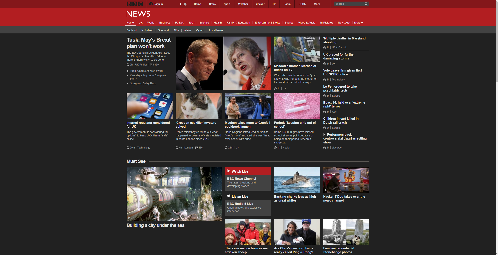
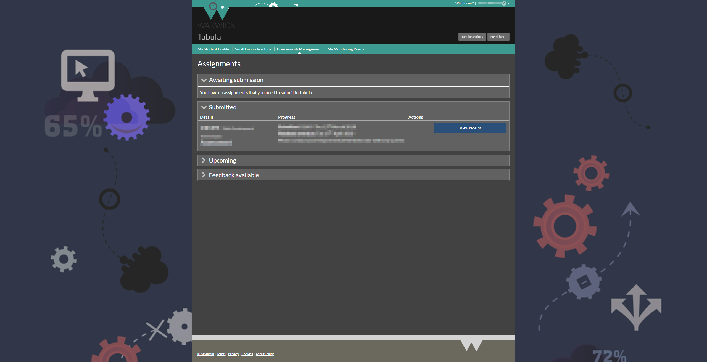

# userstyles
Custom CSS styling for various websites.

You need a Userstyle Manager to use these, I recommend [stylus](https://github.com/openstyles/stylus). **I don't recommend using Stylish, as it collects your browsing data, and doesn't support UserCSS.**

If you find a problem, please make an issue [here](https://github.com/jamerst/userstyles/issues) and I'll look into it.

## Dark BBC News

A full dark theme for BBC News.

[Install via UserCSS](https://github.com/jamerst/userstyles/raw/master/dark_bbc_news.user.css) (Requires a Userstyle manager which supports UserCSS, e.g. [stylus](https://github.com/openstyles/stylus))

Alternatively, [Install from userstyles.org](https://userstyles.org/styles/164324/bbc-news-dark) (doesn't support auto-updating)

## Dark Warwick

A dark theme for University of Warwick pages. Applies to main site, Tabula and websignon.

This style may not work well on some pages, the styling of pages varies massively from department to department, and as I don't have access to all pages, I can't easily test the styles. If you're happy to test for me, let me know and I'll look into it.

[Install via UserCSS](https://github.com/jamerst/userstyles/raw/master/dark_warwick.user.css) (Requires a Userstyle manager which supports UserCSS, e.g. [stylus](https://github.com/openstyles/stylus))

Alternatively, [Install from userstyles.org](https://userstyles.org/styles/160641/dark-warwick) (doesn't support auto-updating)
